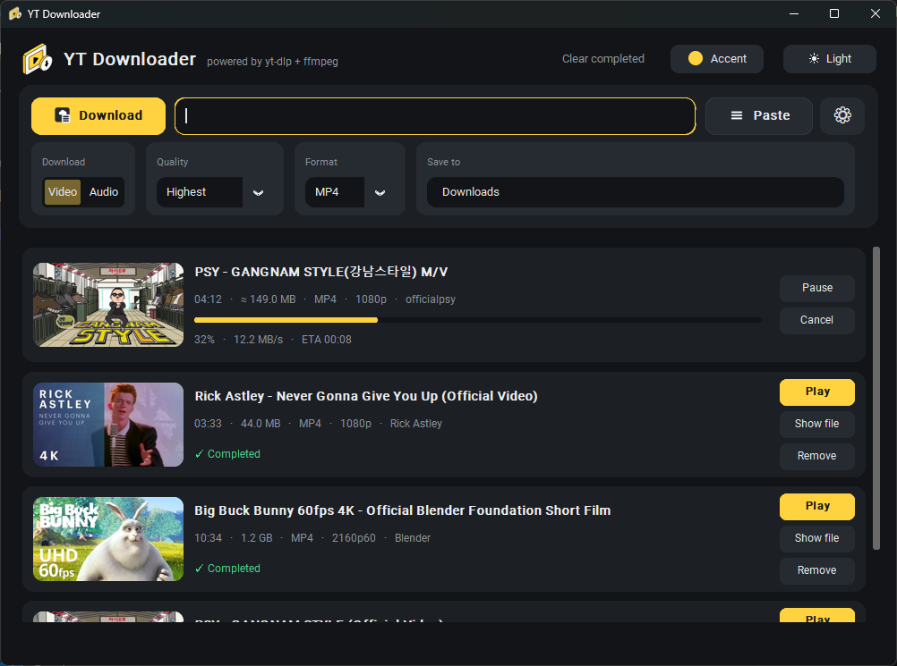
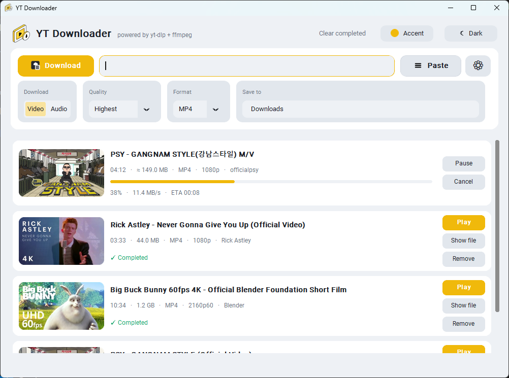

# YT Downloader

A modern desktop video & audio downloader powered by **yt-dlp** and **ffmpeg**.
Both tools are **downloaded automatically on first run** — nothing to install by hand.

## Download for Windows

**[⬇ Download YT-Downloader.exe](https://github.com/jackhallloween21/video-audio-downloader/releases/latest/download/YT-Downloader.exe)** (~20 MB)

No installer, no terminal window — just run it. Every published build is attached to the
[Releases page](https://github.com/jackhallloween21/video-audio-downloader/releases).

## Screenshots

**Dark mode**



**Light mode**



<p align="center"></p>

## Features

- **Download list** with thumbnail, title, duration, file size, format and resolution (like 4K Video Downloader)
- **Paste Link** button — grabs links from your clipboard (several at once is fine)
- Video (MP4 / MKV / WEBM, up to 4K) or audio only (MP3 / M4A / OPUS / FLAC / WAV)
- **Fast multi-segment downloads** — each file is split across up to 16 parallel connections
  (aria2c, downloaded for you) plus 8 concurrent HLS/DASH fragments, with a safe single-stream
  fallback if a server misbehaves
- **Dark and light mode** — switch with the ☀ / ☾ button in the header; the choice is remembered
- **Accent color picker** — the **Accent** button in the header (next to the light/dark toggle)
  opens a grid of named color swatches (Acid Lime, Amber, Fuchsia, Lavender, Neon, Sky …) or a
  full color wheel for any custom hex; applied instantly and remembered across restarts
- **Explicit download flow** — pasted links land in the list for review, then a Download button
  (per-row, or the toolbar ⬇ Download button for everything queued) starts them; nothing auto-starts
- **Pause / resume** — Pause stops a running download and keeps the partial file; Resume continues
  from where it stopped (multi-segment downloads pick up via aria2c's control file)
- Quality picker, live progress, speed and ETA, cancel / retry
- Playlists expand into individual items (saved in a sub-folder)
- Parallel downloads (1–4), embed metadata / thumbnail
- Download history survives restarts; Play and *Show file* buttons
- Modern, clean UI — and **no terminal window pops up**

## Run from source

Requires Python 3.9+ (with Tk — bundled on Windows/macOS; on Debian/Ubuntu: `sudo apt install python3-tk`).

```bash
pip install -r requirements.txt
python ytdl_gui.py          # Windows: use  pythonw ytdl_gui.py  for zero console flash
```

(If you skip `pip install`, the app will try to install `customtkinter` and `pillow` itself.)

First launch downloads yt-dlp, ffmpeg, aria2c (multi-segment downloader) and a small JavaScript
runtime (Deno, which recent yt-dlp versions use for YouTube) into `~/.ytdl_gui/bin`. Tools already
on your `PATH` are used instead.

## Build the Windows .exe

### Automatically with GitHub Actions

1. Push this repo to GitHub.
2. Create and push a version tag:
   ```bash
   git tag v1.0.0
   git push origin v1.0.0
   ```
3. The **Build Windows EXE** workflow runs and attaches `YT-Downloader.exe` to a new
   GitHub Release. You can also start it manually: *Actions → Build Windows EXE → Run workflow*
   and download the file from the run's **Artifacts**.

The workflow lives in `.github/workflows/build.yml`; it uses PyInstaller with `--windowed`
(no console) and `--icon assets/icon.ico`.

### Locally

```bash
pip install -r requirements.txt pyinstaller
pyinstaller --noconfirm --clean --onefile --windowed ^
  --name YT-Downloader --icon assets/icon.ico ^
  --add-data "assets;assets" --collect-all customtkinter ytdl_gui.py
```
(Use `\` instead of `^` on macOS/Linux, and `:` instead of `;` in `--add-data`.)
The result is `dist/YT-Downloader.exe`.

### Changing the icon

Replace `assets/icon.png` (512×512 PNG) and regenerate the `.ico`:

```bash
python -c "from PIL import Image; Image.open('assets/icon.png').save('assets/icon.ico', sizes=[(16,16),(32,32),(48,48),(64,64),(128,128),(256,256)])"
```

## Files & data

| What | Where |
|---|---|
| yt-dlp / ffmpeg / aria2c / deno | `~/.ytdl_gui/bin` |
| Settings, history, thumbnail cache | `~/.ytdl_gui/` |
| Downloads | the *Save to* folder (default: `Downloads`) |

## Troubleshooting

- **Only low resolutions on YouTube / "sign in" errors** — click ⚙ → *Update yt-dlp*. YouTube changes often, and updating fixes most issues.
- **Antivirus / SmartScreen warning on the .exe** — common for unsigned PyInstaller apps. Build it yourself from source, or code-sign it.
- **`tkinter` not found (Linux)** — `sudo apt install python3-tk`.
- **A playlist link only downloads one video** — links like `watch?v=…&list=…` are treated as a single video; paste the playlist's own URL (`/playlist?list=…`) to get all items.

## Legal

Only download content you have the right to download. Respect the terms of the sites you use and copyright law.
